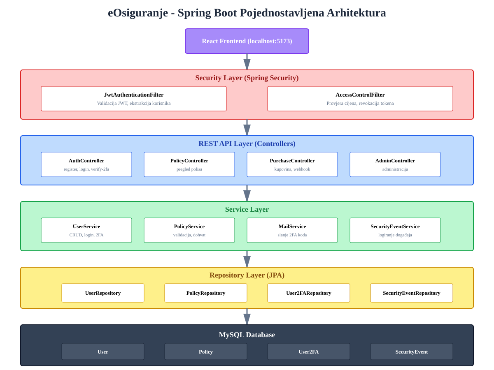
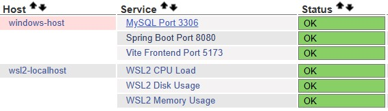

# eOsiguranje - Spring Boot Backend

Backend application for electronic insurance system.

## 🛠 Technologies

- Java 17+
- Spring Boot 3.x
- Spring Security (JWT)
- Spring Data JPA
- MySQL
- JavaMail
- Nagios monitoring

## 🏗 Architecture



Application is organized in layers:
- **Security Layer** - JWT authentication and access control
- **Controllers** - REST API endpoints
- **Services** - Business logic
- **Repositories** - JPA data access
- **Database** - MySQL

## ⚙️ Key Features

- User registration and login
- **Two-Factor Authentication (2FA)** via email
- JWT token authentication
- CRUD operations for insurance policies
- Policy purchase with price validation
- Price manipulation detection and token revocation
- Role-based access (CLIENT, ADMIN)
- Security event logging

## 📊 Monitoring

**Nagios** monitoring system implemented for application health tracking, performance monitoring, and alerting.



## 🚀 Getting Started

```bash
# Create MySQL database
CREATE DATABASE eosiguranje;

# Configure application.properties with DB and email credentials

# Run application
mvn spring-boot:run
```

Application available at: `http://localhost:8080`

## 🔗 Frontend

Frontend React application is located in a separate repository.

## 📡 API Endpoints

- `POST /api/auth/register` - Registration
- `POST /api/auth/login` - Login
- `POST /api/auth/verify-2fa` - 2FA verification (returns JWT)
- `GET /api/policies` - List policies
- `POST /api/purchase` - Purchase policy (requires JWT)
- `GET /api/admin/*` - Admin endpoints (requires ADMIN role)